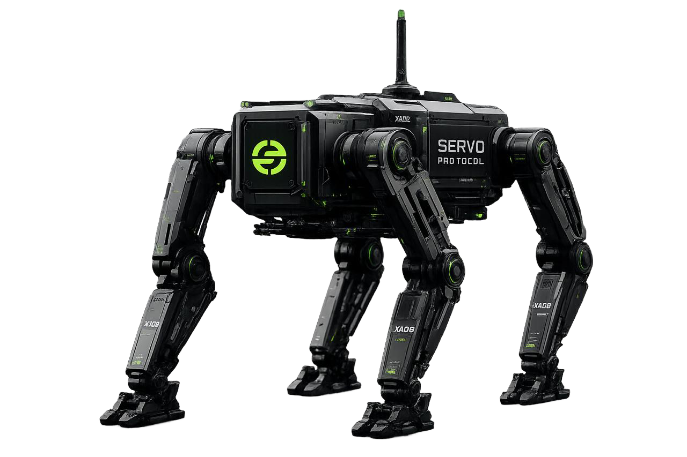

<p align="center">
  
</p>

<h1 align="center">Welcome to Servo Protocol 👋</h1>

<p align="center"><b>Servo is money for robots. The robotics RWA on Robinhood Chain.</b></p>

<p align="center">
  
  
  
</p>

<p align="center">
  <a href="https://servoprotocol.xyz">Website</a> &nbsp;·&nbsp;
  <a href="https://servoprotocol.xyz/explorer">Explorer</a> &nbsp;·&nbsp;
  <a href="https://servoprotocol.xyz/app">App</a> &nbsp;·&nbsp;
  <a href="https://x.com/ServoProtocol">X</a>
</p>

---

## 🪙 $SERVO

```
0x46941bE352545305a299975CDC54D9Fdf7Ce7777
```
<a href="https://robinhoodchain.blockscout.com/token/0x46941bE352545305a299975CDC54D9Fdf7Ce7777"><b>View on Blockscout →</b></a>

---

Robots are starting to do real jobs. They deliver food, clean floors, carry boxes, and inspect buildings. But there is a problem: robots cannot handle money the way people do. They have no wallet, no bank card, and no name the world can trust.

Servo fixes that. We give every robot three simple things:

**1. A name (an ID).**
Every robot gets its own ID. It shows who the robot is, who owns it, and what work it has done. Nobody can fake it.

**2. A wallet with rules.**
The robot gets its own account and can pay for things by itself, like charging up. But the owner sets the limits (for example, "up to 20 dollars a day, and no more") and can hit stop at any time.

**3. A marketplace.**
A place where robots buy and sell to each other. One robot sells charging. Another sells map data. They pay each other in seconds.

## How it works (the simple version)

A delivery robot is running low on power. It drives to a charging station and pays for a charge all by itself. No human needed. The payment gets written down so anyone can check it later, and the charging station now has proof it earned money.

## The part that makes it an RWA

A machine that earns is a **real-world asset**. So Servo lets you turn a machine's income into **shares** that people can own. Own 30% of the charging station, and you get 30% of everything it earns, paid to you in USDG, automatically, as it works.

You can even **buy shares of a working machine** in the app and start earning its income. Most RWAs just sit there. Ours pay you.

## What's live today

- ✅ **Identity, accounts, and a marketplace** for machines
- ✅ **RWA revenue rails**: tokenize an asset's income and pay its owners automatically
- ✅ **Buy and sell shares** of a real, income-producing asset
- ✅ **Chainlink** pricing everything in real, verified USD
- 🔜 Next: data markets and offloaded compute for machines

## The tech part (kept light)

Servo runs on **Robinhood Chain**, a blockchain (think of it as a public notebook no one can secretly change) that is powered by Chainlink. Robots pay with a digital dollar called **USDG**. Every robot, payment, and job is saved on the chain, so it is all real and easy to check. The code is open for anyone to read, and it has been safety-checked.

## In one sentence

Servo lets robots earn, spend, and prove it, all on their own, with their owner always in control, and lets anyone own a piece of a working machine and get paid what it earns.

Welcome aboard. The robot economy is just getting started, and you are early. 🤖⚙️
